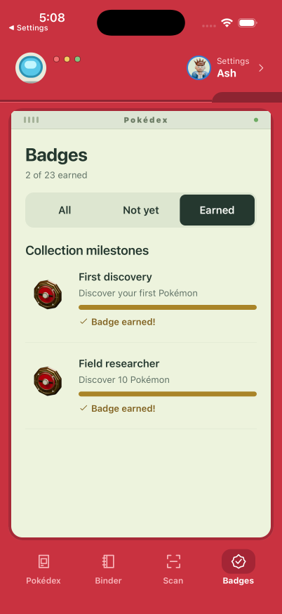
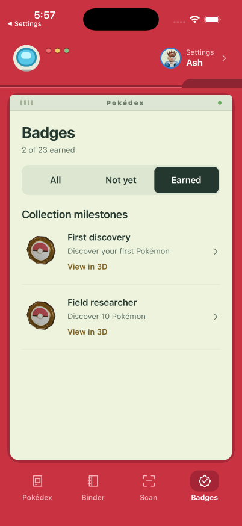
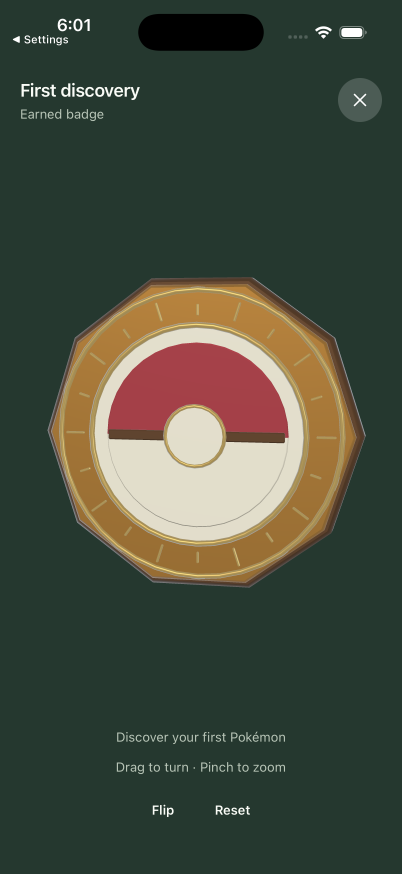
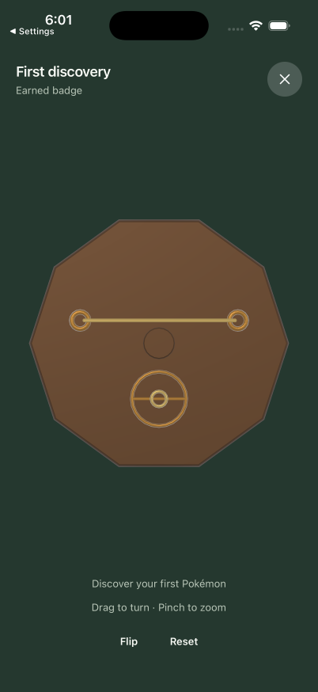

# Inspectable earned badges

Earned badges open a focused, full-screen viewer. Drag to turn the enamel face,
pinch to inspect its depth, or use Flip to see the rear pin clasp. Reset restores
the starting view. The earned list uses a single row action and removes completed
progress bars.

These are actual iPhone 17 Pro / iOS 26.5 simulator captures. The before and after
lists use the same Ash profile, with two earned collection badges. An initial
idle interval was trimmed from the after video; the remaining native interaction
retains its original timing. Videos are compressed to H.264 and screenshots are
unmodified.

| Before | After |
| --- | --- |
|  |  |

| Enamel face | Rear clasp |
| --- | --- |
|  |  |

- [Before recording](before.mp4)
- [After recording: turn, flip, pinch and reset](after.mp4)
- [Native large-text capture](large-text.png)
- [Native Reduce Motion recording](reduced-motion.mp4)

## Verification

- Native drag, pinch, Flip, Reset, dismiss, and app background/resume.
- Native Accessibility Medium text size, with readable description and controls.
- iOS Settings → Accessibility → Motion → Reduce Motion enabled, followed by an
  app relaunch; Flip remains usable with transitions disabled. Settings restored.
- Accessibility tree exposes the viewer as adjustable and reports the visible
  face. Turn, tilt, flip and reset actions provide alternatives to touch gestures.
  VoiceOver speech itself was not automated.
- A missing or failed GL context falls back to the same badge artwork.
- Full typecheck, 159 tests, and iOS/web production exports pass.

## Asset source

`assets/blender/inspectable-badges.blend` contains the shared metal body and seven
emblems. `scripts/blender-badges.py` recreates the compact indexed runtime meshes
and WebP list artwork. The renderer draws on demand and releases its animation
loop when idle, backgrounded or closed.
