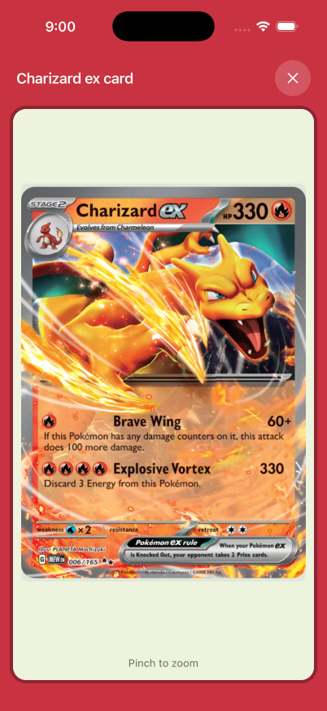
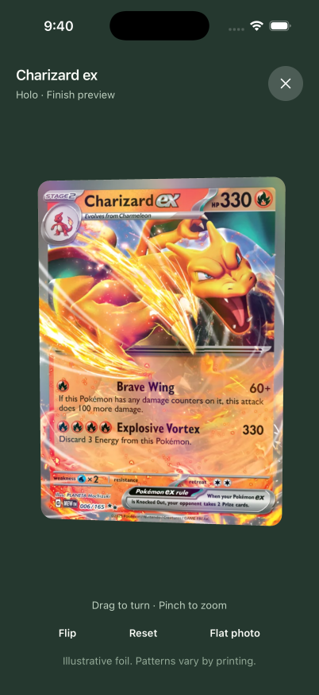
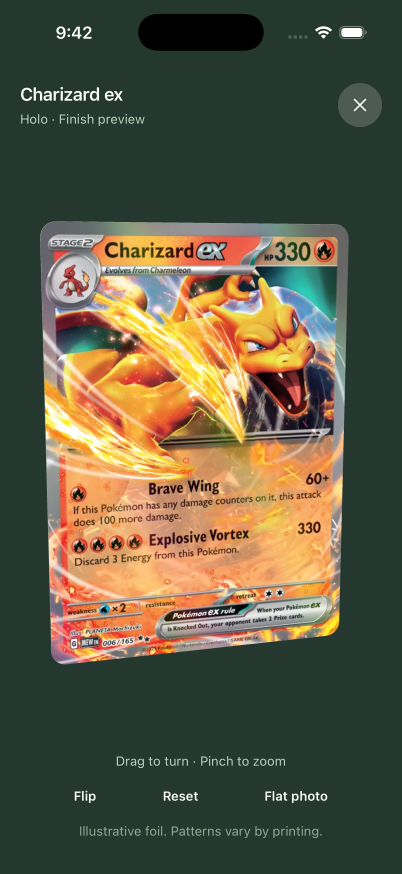
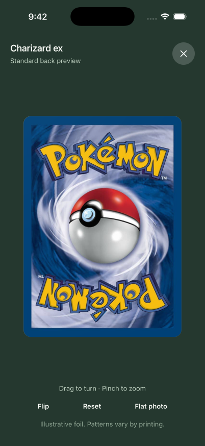
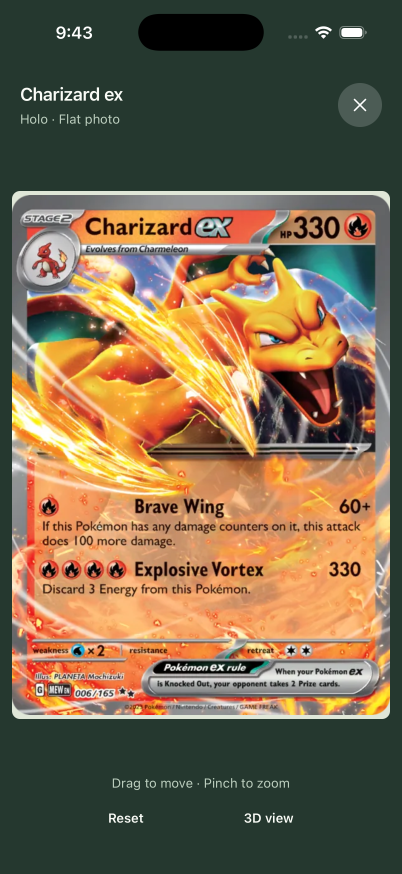
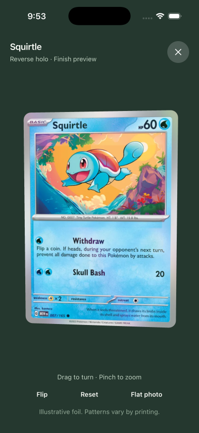
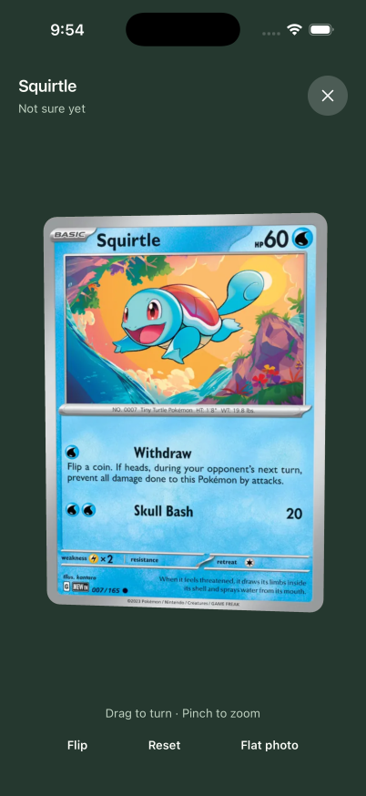
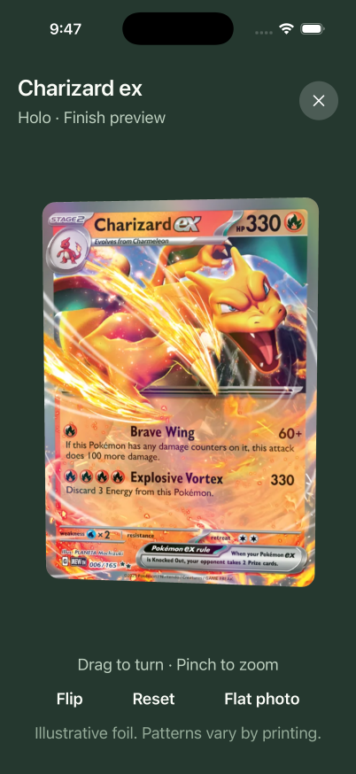
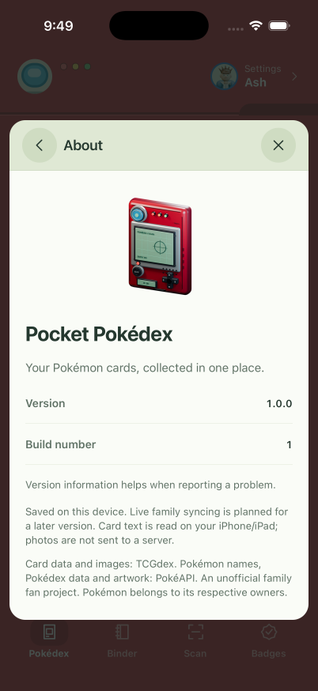

# Interactive card inspection

The full card view uses a rounded, thin Blender mesh with catalog artwork on the front. Drag to turn and tilt, pinch to zoom, or use Flip and Reset. The 3D / Photo switch keeps the readable image viewer. The existing crafted Pokédex render also appears in About.

Motion follows the user's input. The renderer stops drawing at rest and releases its context when hidden. Reduce Motion disables the automatic flip/reset transition and the modal fade. Explicit buttons and accessibility actions supplement gestures, following Apple's [motion](https://developer.apple.com/design/human-interface-guidelines/motion) and [gesture](https://developer.apple.com/design/human-interface-guidelines/gestures) guidance.

## Native evidence

Captured on October 2, 2026 through T3's Device panel and agent-device, on iPhone 17 Pro / iOS 26.5. PNGs are unmodified simulator screenshots at 402 × 874. The video is genuine simulator footage, compressed to 402 × 874 / 30 fps with its original timing; no Blender preview or browser capture is presented as native evidence.

The before screenshot is the previous stack head (`f8929472a7050c7ff82f0bd29f5b10b52e804fef`, PR #33). After captures show this layer. Ash's existing 12-card collection was used without adding cards or saving printing changes.

| Before: flat full view | After: 3D inspection |
| --- | --- |
|  |  |

| Turned card | Standard international back | Photo |
| --- | --- | --- |
|  |  |  |

[Watch the native walkthrough (57 seconds)](card-inspection-demo.mp4): turn, flip, pinch, reset, switch to flat photo, return to 3D.

| Reverse holo | Uncertain printing | Larger accessibility text | About |
| --- | --- | --- | --- |
|  |  |  |  |

Verified in the native simulator: artwork decoding, turning, flipping, pinch zoom, reset, flat-photo switching, returning from Settings while the viewer is open, reverse-holo versus uncertain finish, larger text, and About. Text size was restored to `large`. Browser verification additionally covered the modern Japanese back and a forced WebGL-unavailable fallback to flat photo. Android, iPad, a physical device, and a full VoiceOver session were not run.

Validation: TypeScript, all 149 tests, production iOS and web exports, and an iOS native build (0 errors; 3 Xcode warnings involving duplicate libc++, an RNScreens debug-symbol module-cache file, and the dev-launcher build phase).

## Model and rendering

- Editable model: `assets/blender/collector-card.blend`.
- Reproducible generator: `scripts/blender-card.py`.
- App mesh: `assets/crafted/card-model.json`, 284 triangles / 852 expanded vertices, positions + normals + UVs + material ID. 63 × 88 × 0.3 mm, 3 mm corner radius, 0.05 mm bevel.
- Optional interchange export: `assets/crafted/collector-card.glb`.
- Material IDs: 0 front, 1 back, 2 paper edge. Back UVs are oriented for viewing from behind.
- One mesh and one draw call through Expo GL; rendering is requested on interaction or a brief transition, with no idle animation loop.
- Native textures reuse Expo Image decoding and cache, then serialize PNG for Expo GL, including saved WebP artwork. If decoding or context creation fails, the flat photo remains available.

Regenerate from the repository root:

```sh
/Applications/Blender.app/Contents/MacOS/Blender --background --factory-startup --python scripts/blender-card.py -- --glb
```

## Artwork provenance and preview limits

The card front comes from the app's existing catalog/saved-artwork sources. The shader is an illustrative finish, not a reconstruction of the physical collector's copy. Holo, reverse holo, and full-art rarities select different masks; Regular, First edition, W promo, and Not sure yet never gain synthetic foil from rarity alone. The artwork itself may already depict a particular printing.

The two bundled standard backs were downloaded from official Pokémon sites on October 2, 2026:

| Asset | Official source | Size | SHA-256 |
| --- | --- | --- | --- |
| `international.jpg` | [International card back](https://tcg.pokemon.com/assets/img/global/tcg-card-back-2x.jpg) | 660 × 921 | `37a4df719ed9134a4652c639fea545f549c6cce40647ad5d82909be02a6afeb3` |
| `japanese-modern.jpg` | [Japanese card back](https://www.pokemon-card.com/assets/images/noimage/poke_ura.jpg) | 374 × 523 | `54da6072d5b304d708ab531a52e035dc86fce2305a7190ae9e94bb7d4d9e940f` |

The Japanese source is explicitly linked as the normal-card back in the official [Ancient Mew announcement](https://www.pokemon-card.com/info/0100/01000524_001893.html). English cards use the international standard preview; recognized modern Japanese catalog eras use the Japanese preview. Vintage Japanese cards, unverified Asian-language backs, and identified special backs show a neutral paper surface labeled “Back artwork unavailable.” A standard preview is not evidence of a collector's actual back artwork, condition, or authenticity.
