# Native iOS design review

These are actual iPhone 17 Pro / iOS 26.5 simulator captures. **Before** shows the first design proposal reviewed in this PR stack; **after** shows the completed revision across all three layers. The after photos demonstrate the integrated app, including changes from dependent PRs.

Both versions use Ash's existing collection: 12 cards, 10 discovered Pokémon, 2 earned badges, and no wishlist entries. Default captures use the iOS `large` text setting. Files marked `large-text` use `accessibility-medium`; the app retains its existing 1.4× body text scaling limit. JPEG conversion changes only the image encoding.

The matching route is Pokédex → Binder → Scan → Settings → trainer appearance. Recordings are played at **2× speed**, with no interface content altered:

- [Before simulator walkthrough](native-before-walkthrough.mp4)
- [After simulator walkthrough](native-after-walkthrough.mp4)

## Collection screens

| Screen | Before: first proposal | After: completed revision |
| --- | --- | --- |
| Pokédex | 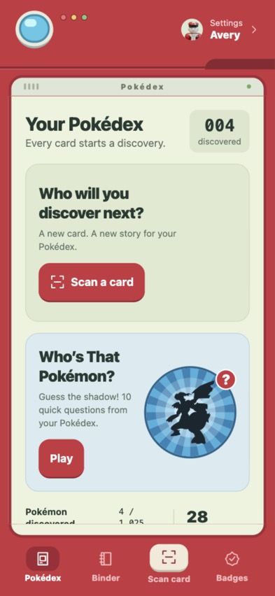 | 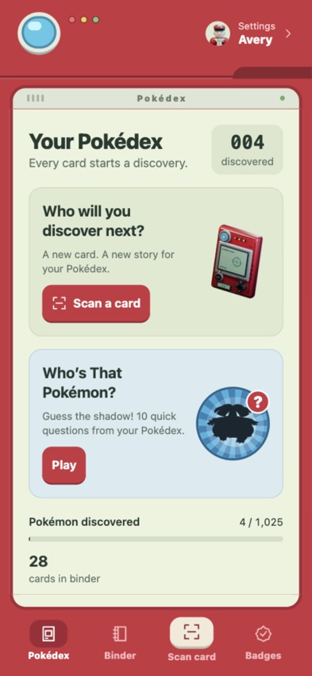 |
| Binder | 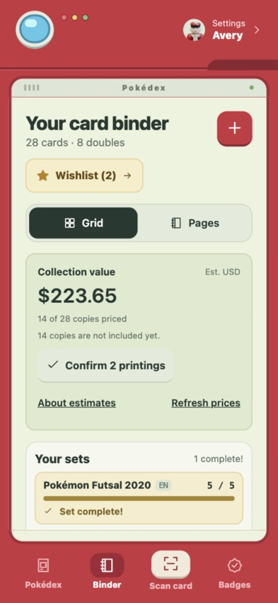 | 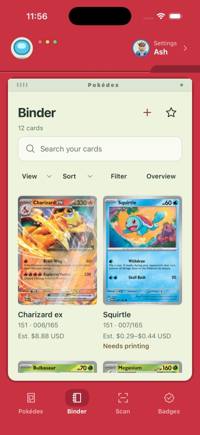 |
| Card captions | 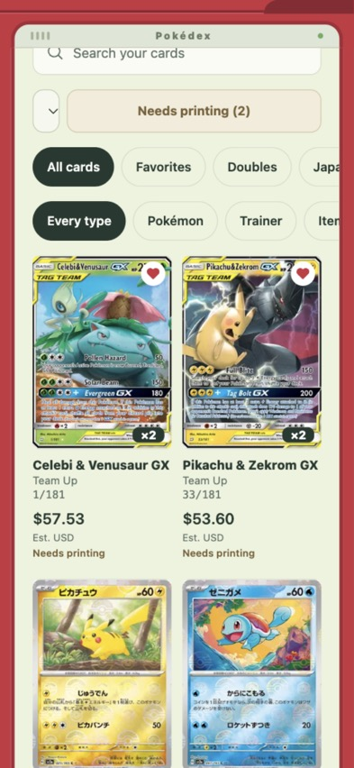 | 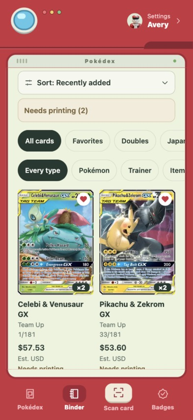 |
| Badges | 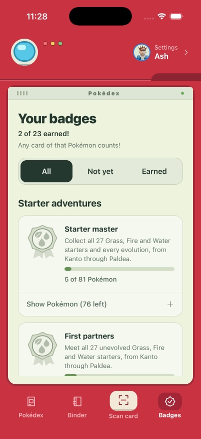 | 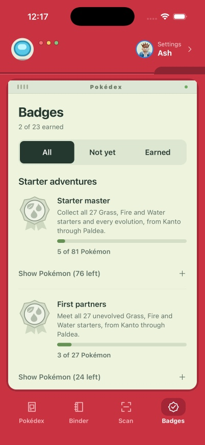 |

Additional native captures: [Binder pages](binder-pages-after.jpg), [Overview](binder-overview-after.jpg), [set checklist](set-checklist-after.jpg), [Quiz](quiz-after.jpg), [larger-text Pokédex](pokedex-large-text-after.jpg), and [larger-text Binder](binder-large-text-after.jpg).

## Capture and sheets

| Screen | Before: first proposal | After: completed revision |
| --- | --- | --- |
| Scan | 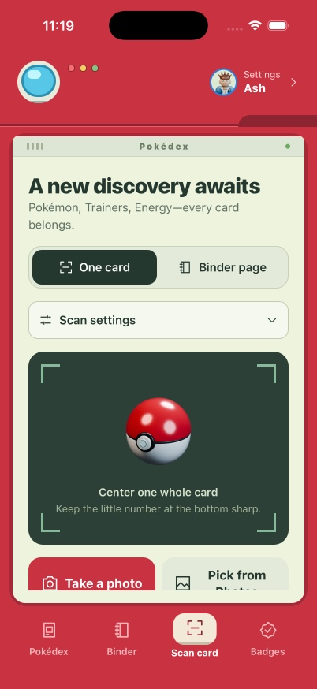 | 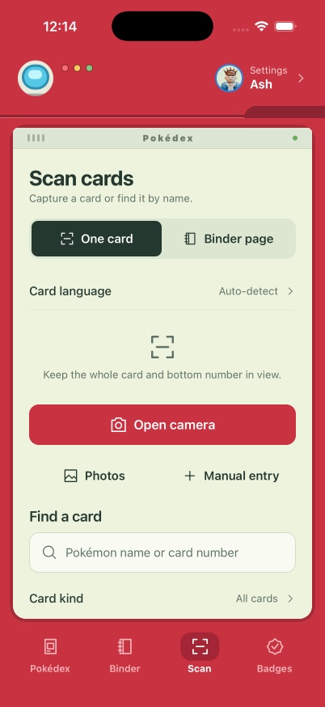 |
| Settings | 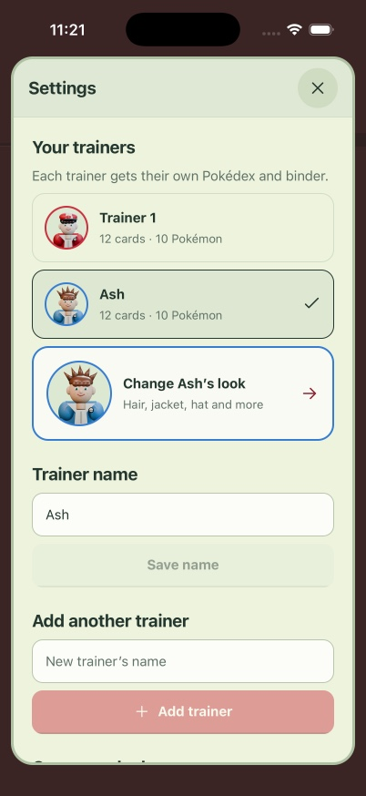 | 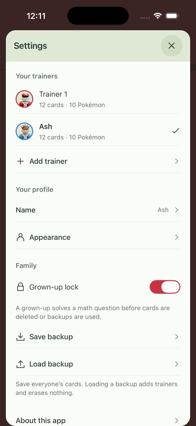 |
| Owned card | 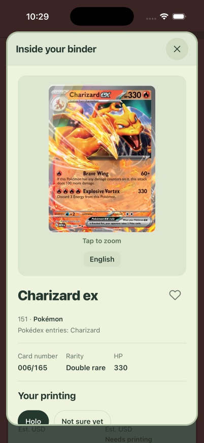 | 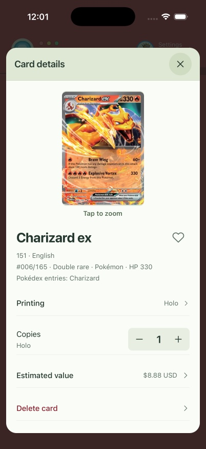 |
| Appearance | 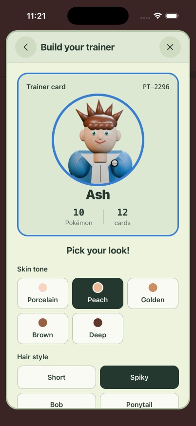 | 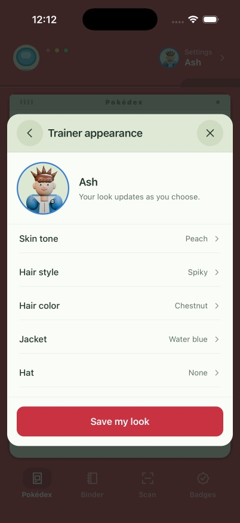 |

Additional native captures: [manual entry](manual-entry-after.jpg), [manual review above the keyboard](manual-keyboard-after.jpg), [unsaved card review](manual-review-after.jpg), [name editor above the keyboard](name-keyboard-after.jpg), [page scan](page-scan-after.jpg), [Pokémon details and evolution](species-after.jpg), [Wishlist](wishlist-after.jpg), [About](about-after.jpg), and a [native choice menu](native-choice-menu-after.jpg).

Larger-text captures: [Scan](native-controls-large-text-after.jpg), [card details](card-large-text-after.jpg), [appearance](builder-large-text-after.jpg), [About](about-large-text-after.jpg), and [reachable deletion confirmation](delete-confirmation-large-text-after.jpg).

## Verification

Native checks covered the main tabs, scrolling with persistent navigation, native sort/view choices, Binder pages, Overview and set checklist handoffs, expanded achievement lists, Quiz opening, Pokémon details, Wishlist, Settings destinations, unsaved appearance changes, the name-editor keyboard, manual entry → card review, page-layout choices, and last-copy removal → Keep it. The default and larger-text layouts were inspected on the simulator. Accessibility snapshots were checked for complete card identities and selected/disabled control states.

No trainer names, appearances, cards, quantities, favorites, or wishes were saved during these checks. The native collection totals remained unchanged.

TypeScript, the 142 existing tests, and the final Expo SDK 57 iOS production export passed. The screen audit and shared patterns are documented in [design-system.md](../design-system.md), with references to Apple's Human Interface Guidelines.
