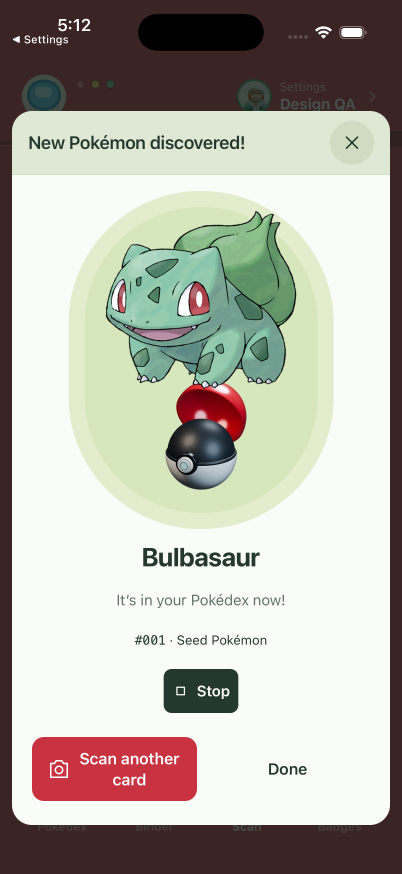
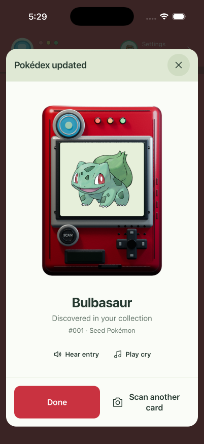

# Pokédex discovery reveal

Adding a Pokémon for the first time wakes the display of the existing Blender Pokédex. Its screen shows the new Pokémon; batch discoveries use previous/next controls instead of a crowded collage. The result stays open until dismissed. Done and rescan remain available in a fixed footer, including at larger text sizes. Narration and cries start only when requested.

The screen wake takes 650 ms, then fades in over 240 ms. Tapping skips it; Reduce Motion shows the result immediately. iOS VoiceOver receives a discovery announcement. Changing entries or closing the sheet cancels pending audio and releases the previous cry.

## Native evidence

These are unretouched iPhone 17 Pro / iOS 26.5 simulator captures, driven through T3's agent-device session. Both comparison images show the same Bulbasaur card added through the normal search/review/save flow in an isolated test trainer. The original trainers were preserved.

| Before | After |
| --- | --- |
|  |  |

- [Before recording](before.mp4), [after recording](after.mp4). Encoded to H.264 at 402 px wide without changing timing. Audio is omitted from the review recordings.
- [Larger text, first TAG TEAM discovery](after-larger-text.png) and [second discovery](after-batch-second.png): accessibility-medium Dynamic Type after relaunch, Pikachu → Zekrom, boundary controls disabled correctly. Optional audio controls are reached by scrolling; completion actions stay visible.
- TypeScript, 149 collection/scan/geometry tests, and iOS/web production exports passed.

## Craft and design reference

`scripts/blender-discovery-device.py` derives the front-facing frame and measured screen rectangle from `assets/blender/pokedex-device.blend`. The new editable file is `assets/blender/discovery-device.blend`; native Pokémon art and all text remain separate from the modeled shell. The screen metadata scales with the PNG, so the artwork stays aligned on narrow and large displays.

The interaction follows Apple's [Motion](https://developer.apple.com/design/human-interface-guidelines/motion) guidance on brief, optional feedback and [Accessibility](https://developer.apple.com/design/human-interface-guidelines/accessibility) guidance on gesture alternatives, larger text, and user-controlled playback.
