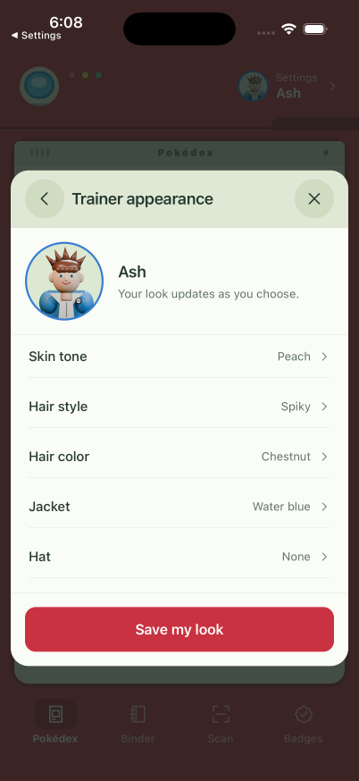
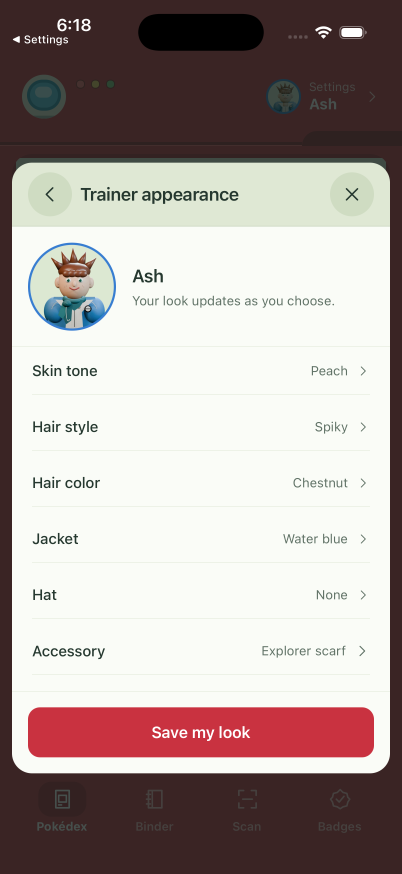

# Earned trainer accessories

Trainer Appearance has one Accessory row leading to a quiet picker with portrait
previews. Choosing an earned item updates the draft; Save my look commits it.
Locked items show discovery progress and cannot be selected. Existing skin,
hair, jacket and hat choices remain available.

| Accessory | Milestone |
| --- | --- |
| Field pin | Discover 1 Pokémon |
| Explorer scarf | Discover 10 Pokémon |
| Expedition satchel | Discover 25 Pokémon |

Unlocks count unique Pokémon, including each Pokémon on a TAG TEAM card. Copies,
languages and finishes do not inflate progress. A permanent, per-trainer ledger
retains rewards after cards are removed or an addition is undone. Existing saves
receive their eligible rewards silently, without changing the equipped look.
Backups and imports carry both reward history and the selected accessory.

## Actual iOS simulator captures

Captured on iPhone 17 Pro / iOS 26.5. The main comparison uses the same Ash
appearance; the after image previews an earned scarf without saving a change to
that profile. Screenshots are unmodified and recordings retain their original
timing, compressed to H.264.

| Before | After |
| --- | --- |
|  |  |

- [Before recording](before.mp4)
- [After recording: picker and scarf preview](after.mp4)
- [Save an earned satchel recording](save.mp4)
- [One discovery: pin earned, scarf and satchel locked](one-discovery.png)
- [Ten discoveries: scarf earned, satchel locked](ten-discoveries.png)
- [All three earned](all-earned.png)
- [Satchel appearance](satchel.png)
- [Large-text appearance](large-appearance.png) and [large-text picker](large-picker.png)

## Verification and fixture scope

- A temporary Design QA trainer was created for testing. Its first card was
  saved through the native app. Locked choices were tapped and remained locked;
  the field pin was equipped and saved through the native picker.
- For the 25-discovery check, only that QA trainer received 25 valid manual-card
  fixtures. Saving the satchel wrote all three awards and the equipped choice.
  After removing its fixture entries and relaunching, the satchel and all earned
  choices remained available. The large-text captures show this zero-card state.
- Native Accessibility Medium text size keeps the picker, appearance values and
  Save my look readable. Selected and locked options expose their states in the
  accessibility tree; portrait layers are decorative.
- The temporary trainer was removed and the original active trainer restored.
  Original trainer entries and appearances match the pre-review snapshot.
- Full typecheck, all 171 tests, and iOS/web production exports pass. Twelve new
  tests cover milestone boundaries, deduplication, history, migration, malformed
  cosmetic data, backup/import isolation, removal and undo.

## Blender source

`assets/blender/trainer-accessories.blend` and
`scripts/blender-trainer-accessories.py` recreate the brass compass pin, woven
scarf and canvas/leather satchel. The aligned transparent renders share the
original portrait camera and include a face occlusion matte. They add 11,998
bytes to runtime assets and compose after the face and before headwear.
